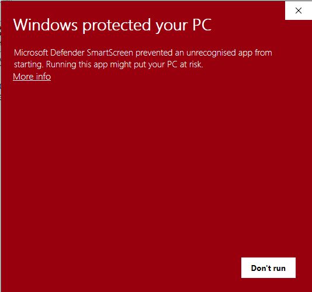
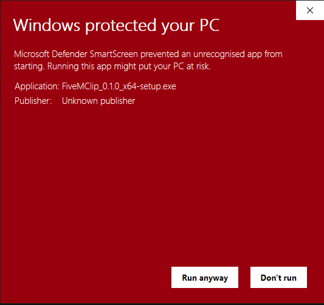

# FiveMClip

A local-first clip recorder for FiveM. Keeps the last few minutes of gameplay in
a rolling buffer, saves it to your own drive when you hit a key, takes
screenshots, and shares them without an account, a watermark, or a subscription.

Built for handing out to a community: one installer, no login, nothing phones
home.

## Scope

FiveMClip is built and maintained for FiveM. It records the screen rather than a
particular game, so it works with anything you happen to be playing - but FiveM
is what gets tested, and what bugs get fixed for.

If it does not work with some other game, that is not a bug that will be chased.
It is MIT licensed and the source is right here: fork it and make it work for
your case.

---

## What it does

- **Replay buffer.** Recording runs continuously in the background. Press the
  hotkey and the last N seconds are written out — no re-encoding, so it lands in
  about a second even for a five minute buffer.
- **Screenshots** on a separate hotkey, PNG or JPEG.
- **Hardware encoding** via NVENC, AMD AMF or Intel Quick Sync, captured with
  DXGI Desktop Duplication. The app tests every combination on first launch and
  keeps whichever actually works on that PC.
- **Game and mic audio**, mixed with independent volume controls.
- **ImgBB upload** for screenshots, with the link copied to your clipboard.
- **YouTube hand-off** for clips (see below).
- **Tray resident.** Closing the window keeps recording. Optionally only records
  while a game you have named is running, so it is not burning your GPU on the
  desktop.

Settings has a list of executables that mean "record now", pre-filled with
FiveM and RedM. Add anything you like, or turn the condition off and have the
buffer always running.

Everything is written to `%USERPROFILE%\Videos\FiveMClip` by default and stays
there.

## Install

Grab the installer from the [Releases](../../releases) page and run it. It
installs per-user, so there is no UAC prompt.

### Windows will try to stop you

Releases are not code-signed, so Windows SmartScreen blocks the installer. This
is not a sign anything is wrong - it is what Windows shows for any application
whose publisher it does not recognise, which includes every small project that
has not paid for a certificate.

You will see this:



Click **More info**. The dialog expands to show what is being run:



Then click **Run anyway**.

"Unknown publisher" is expected - it means unsigned, not unsafe. If you would
rather check before trusting it: every release is scanned on VirusTotal, and
the source of exactly what you are installing is in this repository.

### Portable

Every release also ships `FiveMClip-<version>-portable.zip`. Unzip it somewhere
you have write access and run `FiveMClip.exe` - no installer, no admin, nothing
written outside the folder.

|  | Installer | Portable |
| --- | --- | --- |
| Settings live in | your Windows profile | the program's folder |
| Recordings default to | `Videos\FiveMClip` | a folder beside the program |
| Start with Windows | yes | yes, while the folder stays put |
| WebView2 runtime | installed if missing | must already be present |
| Uninstall | Add or remove programs | delete the folder |

Portable is the better choice on a shared or locked-down PC, or to try
FiveMClip without installing anything. The installer is the better choice
otherwise, mainly because it sorts out WebView2 - which ships with Windows 11
and most Windows 10 installs, but not all.

Portable mode is switched on by the `portable.txt` file in the zip. Delete it
and that copy behaves like an installed one.

### Default hotkeys

| Action | Key |
| --- | --- |
| Save clip | `F9` |
| Screenshot | `F10` |
| Start/stop buffer | `Ctrl+F9` |

All three are rebindable in Settings.

## Hiding things in screenshots

Screenshots have a **Hide things** button in the Library, and region captures
can open it automatically (Settings → Screenshots). Drag a box over anything
that should not be shared - a name, a plate, staff chat, a warrant reference.

Three tools, and the difference between them matters:

| | What it does | Safe for real details? |
| --- | --- | --- |
| **Black out** | Solid fill | **Yes** |
| Pixelate | Coarse blocks | No |
| Blur | Heavy blur | No |

**Pixelation and blur can be reversed.** Tools exist that reconstruct
pixelated text when the font is known - which for a game interface it always
is - and heavy blur is better but not a guarantee. For a real name, address,
plate or case reference, use **Black out**; it is the default for that reason.
Pixelate and blur are there for when you want to obscure something without the
screenshot looking censored.

Saving overwrites the original, so an unredacted copy is not left sitting in
your screenshots folder. **Save a copy** keeps both, when the original still
matters.

## Sharing

### ImgBB (screenshots)

Get a free API key from [api.imgbb.com](https://api.imgbb.com/) and paste it into
Settings. Turn on *Upload every screenshot automatically* and every screenshot
lands on your clipboard as a link, ready to paste into Discord.

The key is yours and is stored only on your PC. FiveMClip deliberately does not
ship a shared key — a key baked into a distributed binary gets extracted and
rate-limited within a week, and then it stops working for everybody.

### YouTube (clips)

The **To YouTube** button opens YouTube's upload page, reveals the clip in
Explorer, and puts its full path on your clipboard so you can paste it straight
into the file picker.

This is a deliberate choice rather than a missing feature. Uploading through the
YouTube Data API would mean:

- **1,600 quota units per upload**, against a default project quota of 10,000 per
  day. That is six uploads per day shared across *everyone* using the app, not
  per person.
- **Every video forced to private** until the OAuth client passes Google's
  YouTube API audit, which needs a published privacy policy, a homepage, a demo
  video, and several weeks of review.

Two clicks beats a broken upload button. If you later want true one-click
uploads, the options are to complete Google's audit for a single shared client,
or to have each user create their own Google Cloud project and paste in a client
ID.

## Is this safe to use with FiveM?

It captures the screen through the Windows Desktop Duplication API and reads
audio through WASAPI loopback. It does not hook, inject into, or read the memory
of the game process, and the window is an ordinary desktop window rather than an
in-game overlay. That is the same approach OBS uses for display capture.

## Building from source

You need [Rust](https://rustup.rs/) and Windows 10 or 11.

```powershell
# Fetch the ffmpeg build that gets bundled (~80 MB, not committed)
./tools/fetch-ffmpeg.ps1

cargo install tauri-cli --version "^2" --locked
cargo tauri build
```

The installer is written to `target/release/bundle/nsis/`.

For a dev loop with hot reload of the UI:

```powershell
cargo tauri dev
```

CI runs formatting, clippy and tests on every push. Building the installer is
the expensive half, so it only runs when you ask for it: hit **Run workflow** on
the Actions tab to get an installer to try, or push a tag matching `v*` to build
one and publish it as a GitHub release.

See [docs/architecture.md](docs/architecture.md) for the project layout, how the
replay buffer works, and how to type-check the Windows-only code from any
platform.

## Code signing

Releases are unsigned. Signing is worth doing eventually - reputation
accumulates on a certificate and carries across releases, where an unsigned
build starts from zero every time, and signing also cuts down antivirus false
positives.

It is not as simple as buying a certificate any more, and the options are
genuinely constrained by CI. The reasoning, the costs, and how to switch it on
are in [docs/signing.md](docs/signing.md).

## Troubleshooting

**"No screen capture method worked on this PC."** Hit *Re-test this PC* on the
Record tab — it lists exactly what each method reported. Desktop Duplication is
blocked in some RDP and virtual-machine sessions.

**Recording, but the clip has no audio.** The Record tab shows a warning naming
the reason. Usually there is no default playback device, or another app has the
device open in exclusive mode.

**Clip captures the wrong monitor.** Desktop Duplication numbers its outputs
independently of Windows' display numbering. Use the *Test* button next to the
monitor picker — it saves a screenshot from whichever monitor is selected.

**Hotkey does nothing.** Something else has it registered globally. Any failure
is reported as a Windows notification when settings are saved; pick another key.

## Licence

FiveMClip is MIT licensed — see [LICENSE](LICENSE).

It bundles an unmodified ffmpeg binary, which is GPL licensed and carries its own
obligations. See [THIRD-PARTY.md](THIRD-PARTY.md) before redistributing.
